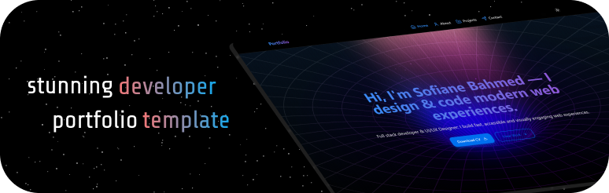

# Modern & Animated Portfolio Template

This is a modern, animated, and fully responsive portfolio template built with **nextjs**, **typescript**, **Tailwind CSS**, and **Framer Motion**. It's designed to be easily customizable and provides a great starting point for developers who want to create a stunning personal portfolio.

<br/>
<p align="center">
  <a href="https://portfolio-template-seven-murex.vercel.app" target="_blank">
    
  </a>
</p>

## Features

- **Modern UI/UX:** Clean and visually appealing design.
- **Smooth Animations:** Engaging animations powered by Framer Motion.
- **Responsive Design:** Looks great on all devices, from mobile to desktop.
- **Easy to Customize:** All portfolio data is centralized in a single file for easy updates.
- **Component-Based:** Built with reusable React components.

## Getting Started

### Prerequisites

- Node.js (v18 or higher)
- npm or yarn

### Installation

1. **Clone the repository:**

   ```bash
   git clone https://github.com/Sofiane-Bahmed/portfolio-template.git
   cd portfolio-template
   ```

2. **Install dependencies:**

   ```bash
   npm install
   # or
   yarn install
   ```

3. **Run the development server:**

   ```bash
   npm run dev
   # or
   yarn dev
   ```

   The application will be available at `http://localhost:3000`.

### Building for Production

To create a production build, run:

```bash
npm run build
# or
yarn build
```

This will generate a `dist` directory with the optimized and minified files for deployment.

## Customization

All the data for the portfolio (personal information, projects, skills, etc.) is located in `data/index.ts`. You can easily customize the content by modifying this file.

### `data/index.ts`

This file exports a `DATA` object that contains all the information for your portfolio. Here's a breakdown of the structure:

- `home`: Content for the home page, including the hero section, skills overview, and testimonials.
- `about`: Information for the about page, including your profile, education, experience, and technologies.
- `projects`: A list of your featured projects, including details, images, and links.
- `contact`: Contact information and the Google Maps source for the contact page.
- `morphingTexts`: The texts used in the morphing text animations on each page.
- `navigation`: The links for the main navigation menu.
- `footer`: Content for the footer, including social links and services.

Simply update the values in this file to personalize your portfolio.

**How to Add Your CV**

1. `Upload Your CV` : Place your CV file in the `public` folder of the project.

2. `Update the Download Link` : Modify the `href` attribute of the "Download CV" button in the `hero.tsx` file to point to your uploaded CV.

Here's an example

```hero.tsx
            <Link
              download
              aria-label="Download CV in PDF format"
              className="w-full sm:w-auto"
              href="/your-cv-filename.pdf"
            >
              <Button
                fullWidth
                aria-label="Downoald CV"
                color="primary"
                endContent={<Icon icon="lucide:download" />}
                size="lg"
                variant="shadow"
              >
                Download CV
              </Button>
            </Link>

```

## Contact Form Setup (Email.js)

This template uses [Email.js](https://www.emailjs.com/) for handling contact form submissions without a backend. To set it up:

1.  **Create an Email.js account:** If you don't have one, sign up at [Email.js](https://www.emailjs.com/).

2.  **Create a new Email Service:** Go to Email Services and add a new service (e.g., Gmail, Outlook). Follow the instructions to connect your email account.

3.  **Create a new Email Template:** Go to Email Templates and create a new template. You can use the default template or customize it. Make note of your **Template ID**.

    Here's an example template you can use:
    
```jsx
<div style="font-family: system-ui, sans-serif, Arial; font-size: 12px">
  <div>
    A message by <strong>{{name}}</strong> ({{email}}) has been received with the subject
    "<strong>{{subject}}</strong>". Kindly respond at your earliest convenience.
  </div>

  <div
    style="
      margin-top: 20px;
      padding: 15px 0;
      border-width: 1px 0;
      border-style: dashed;
      border-color: lightgrey;
    "
  >
    <table role="presentation">
      <tr>
        <td style="vertical-align: top">
          <div
            style="
              padding: 6px 10px;
              margin: 0 10px;
              background-color: aliceblue;
              border-radius: 5px;
              font-size: 26px;
            "
            role="img"
          >
            &#x1F4E7;
          </div>
        </td>
        <td style="vertical-align: top">
          <div style="color: #2c3e50; font-size: 16px">
            <strong>{{name}}</strong> — <a href="mailto:{{email}}" style="color: #3498db">{{email}}</a>
          </div>
          <div style="color: #999999; font-size: 13px"><em>Subject:</em> {{subject}}</div>
          <p style="font-size: 16px; margin-top: 10px">{{message}}</p>
        </td>
      </tr>
    </table>
  </div>
</div>


```

4.  **Get your Public Key:** You can find your Public Key under **Account** -> **API Keys**.

5.  **Configure Environment Variables:** Create a `.env.local` file in the root of your project (if it doesn't exist) and add the following environment variables:

    ```
    NEXT_PUBLIC_EMAILJS_SERVICE_ID=your_service_id
    NEXT_PUBLIC_EMAILJS_TEMPLATE_ID=your_template_id
    NEXT_PUBLIC_EMAILJS_PUBLIC_KEY=your_public_key
    ```

    Replace `your_service_id`, `your_template_id`, and `your_public_key` with the values from your Email.js account.

6.  **Restart your development server:** After adding the environment variables, restart your development server (`npm run dev` or `yarn dev`) for the changes to take effect.

## Technologies Used

- **[Next.js](https://nextjs.org/):** A React framework for production.
- **[React](https://react.dev/):** A JavaScript library for building user interfaces.
- **[Tailwind CSS](https://tailwindcss.com/):** A utility-first CSS framework.
- **[Framer Motion](https://www.framer.com/motion/):** A library for creating animations in React.
- **[HeroUI](https://www.heroui.com/):** A React UI library for beautiful and accessible components.
- **[Iconify](https://iconify.design/):** A library for using icons from various icon sets.
- **[TypeScript](https://www.typescriptlang.org/):** A typed superset of JavaScript.


## License

This project is licensed under the MIT License. See the `LICENSE` file for more details.